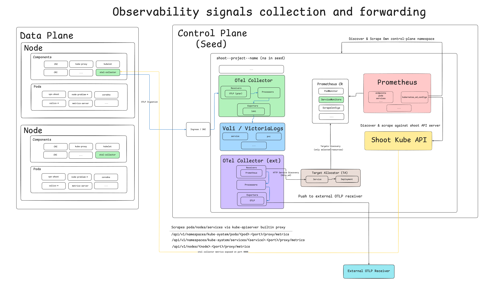

# gardener-extension-otelcol

The `gardener-extension-otelcol` repo provides a Gardener Extension for an
OpenTelemetry Collector, which runs in the shoot control-plane namespace and
forwards observability signals for control-plane components to a remote
OpenTelemetry Collector receiver.

> [!WARNING]
> This extension is in early development state. Do not use it in a production environment.



# Requirements

- [Go 1.25.x](https://go.dev/) or later
- [GNU Make](https://www.gnu.org/software/make/)
- [Docker](https://www.docker.com/) for local development
- [Gardener Local Setup](https://gardener.cloud/docs/gardener/local_setup/) for local development

# Code structure

The project repo uses the following code structure.

| Package           | Description                                                                               |
|-------------------|-------------------------------------------------------------------------------------------|
| `cmd`             | Command-line application of the extension                                                 |
| `pkg/admission`   | Implementations for the Gardener extension admission `Validator` and `Mutator` interfaces |
| `pkg/apis`        | Extension API types, e.g. configuration spec, etc.                                        |
| `pkg/actuator`    | Implementations for the Gardener Extension Actuator interfaces                            |
| `pkg/controller`  | Utility wrappers for creating Kubernetes reconcilers for Gardener Actuators               |
| `pkg/imagevector` | Image vector for container images                                                         |
| `pkg/heartbeat`   | Utility wrappers for creating heartbeat reconcilers for Gardener extensions               |
| `pkg/metrics`     | Metrics emitted by the extension                                                          |
| `pkg/mgr`         | Utility wrappers for creating `controller-runtime` managers using functional options API  |
| `pkg/version`     | Version metadata information about the extension                                          |
| `internal/tools`  | Go-based tools used for testing and linting the project                                   |
| `charts`          | Helm charts for deploying the extension                                                   |
| `examples`        | Example Kubernetes resources, which can be used in a dev environment                      |
| `test`            | Various files (e.g. schemas, CRDs, etc.), used during testing                             |

# Usage

You can enable the extension for a [Gardener Shoot
cluster](https://gardener.cloud/docs/glossary/_index#gardener-glossary) by
updating the `.spec.extensions` of your shoot manifest.

The following example shoot manifest snippet enables the extension and
configures the OpenTelemetry Collector to emit the metrics signal for the shoot
control-plane components via the
[Debug Exporter](https://github.com/open-telemetry/opentelemetry-collector/tree/main/exporter/debugexporter).
The configuration is exporter-oriented: `spec.targets` is a list of exporter
destinations. Each target pairs a self-contained exporter with the signals it
receives (`metrics`, `logs` and/or `events`) and an optional list of filters.
Each `(target, signal)` pair becomes one collector pipeline, so a target can
fan out several signals to one destination, and a signal can fan out to several
targets. A signal is enabled iff at least one target lists it. Setting a
target's exporter `protocol` to `debug` makes it a debug destination.

``` yaml
...

spec:
  extensions:
    - type: otelcol
      providerConfig:
        apiVersion: otelcol.extensions.gardener.cloud/v1alpha1
        kind: CollectorConfig
        spec:
          targets:
            - exporter:
                protocol: debug
                verbosity: basic  # basic, normal or detailed
              signals: [metrics]
```

This configuration however is only useful while developing or troubleshooting an
issue with the collector, because signals are not actually forwarded to a remote
[OpenTelemetry Collector](https://opentelemetry.io/docs/collector/) receiver.

The following configuration snippet enables the extension for a shoot and
configures it to forward the signals of the control-plane components to a remote
collector. A single target can serve several signals at once via its `signals`
list. Here the target uses the
[OTLP HTTP exporter](https://github.com/open-telemetry/opentelemetry-collector/tree/main/exporter/otlphttpexporter)
(`protocol: http`, the default).

``` yaml
...

spec:
  extensions:
    - type: otelcol
      providerConfig:
        apiVersion: otelcol.extensions.gardener.cloud/v1alpha1
        kind: CollectorConfig
        spec:
          targets:
            - exporter:
                protocol: http  # http or grpc
                endpoint: "https://opentelemetry-receiver.example.org"
              signals: [metrics, logs, events]
```

The following example snippet expands on the previous one by adding
[TLS configuration settings](https://github.com/open-telemetry/opentelemetry-collector/blob/main/config/configtls/README.md) and
[Bearer token authentication](https://github.com/open-telemetry/opentelemetry-collector-contrib/tree/main/extension/bearertokenauthextension) with the remote collector.
These settings live on the target's exporter.

``` yaml
...

spec:
  extensions:
    - type: otelcol
      providerConfig:
        apiVersion: otelcol.extensions.gardener.cloud/v1alpha1
        kind: CollectorConfig
        spec:
          targets:
            - exporter:
                protocol: http
                endpoint: "https://opentelemetry-receiver.example.org"
                token:
                  resourceRef:
                    name: otelcol-bearer-token
                    dataKey: token
                tls:
                  ca:
                    resourceRef:
                      name: otelcol-tls
                      dataKey: ca.crt
                  cert:
                    resourceRef:
                      name: otelcol-tls
                      dataKey: client.crt
                  key:
                    resourceRef:
                      name: otelcol-tls
                      dataKey: client.key
              signals: [metrics]
  resources:
  - name: otelcol-bearer-token
    resourceRef:
      apiVersion: v1
      kind: Secret
      name: my-otelcol-bearer-token
  - name: otelcol-tls
    resourceRef:
      apiVersion: v1
      kind: Secret
      name: my-otelcol-tls
```

In order to provide the `otelcol-tls` and `otelcol-bearer-token` secrets from
the example above to the extension, you should first create the respective
secrets in the shoot project namespace, which can then be referenced via
[Gardener Referenced Resources](https://gardener.cloud/docs/gardener/extensions/referenced-resources/#referenced-resources).

Each target carries its own exporter, so different signals can ship to
different backends over different protocols. This example forwards metrics over
HTTP and the events signal over the
[OTLP gRPC exporter](https://github.com/open-telemetry/opentelemetry-collector/tree/main/exporter/otlpexporter).

``` yaml
  extensions:
    - type: otelcol
      providerConfig:
        apiVersion: otelcol.extensions.gardener.cloud/v1alpha1
        kind: CollectorConfig
        spec:
          targets:
            - exporter:
                endpoint: "https://opentelemetry-receiver.default.svc.cluster.local:4318"
                token:
                  resourceRef:
                    name: otelcol-bearer-token
                    dataKey: token
                tls:
                  ca:
                    resourceRef:
                      name: otelcol-tls
                      dataKey: ca.crt
                  cert:
                    resourceRef:
                      name: otelcol-tls
                      dataKey: client.crt
                  key:
                    resourceRef:
                      name: otelcol-tls
                      dataKey: client.key
              signals: [metrics]
            - exporter:
                protocol: grpc
                endpoint: "https://opentelemetry-receiver.default.svc.cluster.local:4317"
              signals: [events]
```

For additional configuration settings, which can be provided to the extension,
please make sure to check the
[OTel Extension API spec documentation](./docs/api-reference/otelcol.extensions.gardener.cloud.md).

### Fan a signal out to multiple destinations

Because a signal is enabled by listing it in a target's `signals`, the same
signal can appear in several targets and thus be exported to several
destinations at once, each with an independent exporter and filter chain. This
example sends metrics to a primary HTTP collector, a secondary gRPC collector,
and additionally mirrors them to a debug exporter.

``` yaml
  extensions:
    - type: otelcol
      providerConfig:
        apiVersion: otelcol.extensions.gardener.cloud/v1alpha1
        kind: CollectorConfig
        spec:
          targets:
            # Primary: a remote collector over HTTP.
            - exporter:
                endpoint: "https://opentelemetry-receiver.example.org"
              signals: [metrics]
            # Secondary: a different collector over gRPC.
            - exporter:
                protocol: grpc
                endpoint: "https://backup-receiver.example.org:4317"
              signals: [metrics]
            # Debug: write to the collector's own logs. protocol: debug
            # ignores endpoint/tls/token and only honors verbosity.
            - exporter:
                protocol: debug
                verbosity: basic
              signals: [metrics]
```

## Filtering signals

The extension can restrict which telemetry the collector processes at two
levels:
- Enabling or disabling whole signals by listing (or omitting) them in the
targets' `signals`.
- Filtering individual records with OTTL filtration based on OpenTelemetry
[filterprocessor](https://github.com/open-telemetry/opentelemetry-collector-contrib/tree/main/processor/filterprocessor).

### Select which signals are collected

A signal (`metrics`, `logs`, `events`) is collected iff at least one target
lists it in its `signals`. Only enabled signals get a pipeline; a signal listed
by no target is not collected or exported.

``` yaml
spec:
  extensions:
    - type: otelcol
      providerConfig:
        apiVersion: otelcol.extensions.gardener.cloud/v1alpha1
        kind: CollectorConfig
        spec:
          targets:
            # Only collect and export metrics; the other pipelines are not created.
            - exporter:
                endpoint: "https://opentelemetry-receiver.example.org"
              signals: [metrics]
```

### Drop individual records with the filter processor

Each target's `filters` field is an ordered list of filter rules. Each rule
becomes a filterprocessor instance in that target's pipelines, dropping
metrics, logs and events matching the given [OTTL](https://opentelemetry.io/docs/collector/transforming-telemetry/)
conditions or match properties. Because filters live on the target, different
targets serving the same signal can filter independently.

Filter rules mirror the filterprocessor, keyed by signal: a `metrics` block
feeds the target's metrics pipeline and uses `metric`, `datapoint`, `resource`,
`include`/`exclude` (metric match properties) and `metric_conditions`; a `logs`
block feeds the logs and events pipelines and uses `log_record`, `resource`,
`include`/`exclude` (log match properties) and `log_conditions`. A block for a
signal the target does not serve is rejected by validation. The extension
mirrors the filterprocessor filtration, so for more information you can check the
[filterprocessor documentation](https://github.com/open-telemetry/opentelemetry-collector-contrib/blob/main/processor/filterprocessor/README.md).

#### Examples

- The following example drops noisy metrics and logs using OTTL conditions on
the target's per-signal filter blocks.

``` yaml
spec:
  extensions:
    - type: otelcol
      providerConfig:
        apiVersion: otelcol.extensions.gardener.cloud/v1alpha1
        kind: CollectorConfig
        spec:
          targets:
            - exporter:
                endpoint: "https://opentelemetry-receiver.example.org"
              signals: [metrics, logs]
              filters:
                - error_mode: ignore  # ignore, silent or propagate
                  metrics:
                    # Drop individual metrics by name.
                    metric:
                      - 'name == "apiserver_request_total"'
                    # Drop datapoints by value.
                    datapoint:
                      - 'value_int == 0'
                  logs:
                    # Drop log records whose body matches a pattern.
                    log_record:
                      - 'IsMatch(body, ".*password.*")'
```

- The next example uses the declarative include/exclude match properties instead
of OTTL conditions. Here only metrics whose name matches one of the given
patterns are kept.

``` yaml
spec:
  extensions:
    - type: otelcol
      providerConfig:
        apiVersion: otelcol.extensions.gardener.cloud/v1alpha1
        kind: CollectorConfig
        spec:
          targets:
            - exporter:
                endpoint: "https://opentelemetry-receiver.example.org"
              signals: [metrics]
              filters:
                - metrics:
                    include:
                      match_type: regexp  # strict or regexp
                      metric_names:
                        - "apiserver_.*"
                        - "etcd_.*"
```

# Development

In order to build a binary of the extension, you can use the following command.

``` shell
make build
```

The resulting binary can be found in `bin/extension`.

In order to build a Docker image of the extension, you can use the following
command.

``` shell
make docker-build
```

Run the following command to get usage info about the available Makefile
targets.

``` shell
make help
```

For local development of the `gardener-extension-otelcol` it is recommended that
you setup a [development Gardener environment](https://gardener.cloud/docs/gardener/local_setup/).

Please refer to the next sections for more information about deploying and
testing the extension in a Gardener development environment.

## Development Environment with Gardener Operator

The extension can also be deployed via the
[Gardener Operator](https://gardener.cloud/docs/gardener/concepts/operator/).

In order to start a local development environment with the Gardener Operator,
please refer to the following documentations.

- [Gardener Operator](https://gardener.cloud/docs/gardener/concepts/operator/)
- [Gardener: Deploying Gardener Locally](https://gardener.cloud/docs/gardener/deployment/getting_started_locally/)

In summary, these are the steps you need to follow in order to start a local
development environment with the [Gardener Operator](https://gardener.cloud/docs/gardener/concepts/operator/),
however, please make sure that you read the documents above for additional details.

``` shell
make kind-up gardener-up
```

Before you continue with the next steps, make sure that you configure your
`KUBECONFIG` to point to the kubeconfig file of the cluster, which runs the
Gardener Operator.

There will be two kubeconfig files created for you, after the dev environment
has been created.

| Path                                                                | Description                                            |
|---------------------------------------------------------------------|--------------------------------------------------------|
| `/path/to/gardener/dev-setup/kubeconfigs/runtime/kubeconfig`        | The _runtime_ cluster (`gardener-operator` runs in it) |
| `/path/to/gardener/dev-setup/kubeconfigs/virtual-garden/kubeconfig` | The _virtual_ garden cluster                           |

Throughout this document we will refer to the kubeconfigs for _runtime_ and
_virtual_ clusters as `$KUBECONFIG_RUNTIME` and `$KUBECONFIG_VIRTUAL`
respectively.

Before deploying the extension we need to target the _runtime_ cluster, since
this is where the extension resources for `gardener-operator` reside.

``` shell
export KUBECONFIG=$KUBECONFIG_RUNTIME
```

In order to deploy the extension, execute the following command.

``` shell
make deploy-operator
```

The `deploy-operator` target takes care of the following.

1. Builds a Docker image of the extension
2. Loads the image into the `kind` cluster nodes
3. Packages the Helm charts and pushes them to the local registry
4. Deploys the `Extension` (from group `operator.gardener.cloud/v1alpha1`) to
   the _runtime_ cluster

Verify that we have successfully created the
`Extension` (from group `operator.gardener.cloud/v1alpha1`) resource.

``` shell
$ kubectl --kubeconfig $KUBECONFIG_RUNTIME get extop otelcol
NAME      INSTALLED   REQUIRED RUNTIME   REQUIRED VIRTUAL   AGE
otelcol   True        False              False              13s
```

Verify that the respective `ControllerRegistration` and `ControllerDeployment`
resources have been created by the `gardener-operator` in the _virtual_ garden
cluster.

``` shell
$ kubectl --kubeconfig $KUBECONFIG_VIRTUAL get controllerregistrations,controllerdeployments otelcol
NAME                                                 RESOURCES           AGE
controllerregistration.core.gardener.cloud/otelcol   Extension/otelcol   42s

NAME                                               AGE
controllerdeployment.core.gardener.cloud/otelcol   42s
```

Finally, we can create an example shoot with our extension enabled. The
[examples/shoot.yaml](./examples/shoot.yaml) file provides a ready-to-use shoot
manifest with the extension enabled and configured.

The provided example shoot references secrets from the project namespace, which
are used to configure the TLS settings between the exporter and a local dev
receiver, running in the `default` namespace.

The following commands will create the TLS secrets, a dev OpenTelemetry receiver
in the `default` namespace, and a dev shoot, configured with the extension.

``` shell
kubectl --kubeconfig $KUBECONFIG_RUNTIME apply -f examples/opentelemetry-receiver.yaml
kubectl --kubeconfig $KUBECONFIG_VIRTUAL apply -f examples/secret-tls.yaml
kubectl --kubeconfig $KUBECONFIG_VIRTUAL apply -f examples/secret-bearer-token.yaml
kubectl --kubeconfig $KUBECONFIG_VIRTUAL apply -f examples/shoot.yaml
```

If you have an already existing and running shoot, for which you want to enable
the extension, simply follow the instructions from the previous sections in
order to enable and configure the extension manually.

Once we create the shoot cluster, `gardenlet` will start deploying our
`gardener-extension-otelcol`, since it is required by our shoot.

Verify that the extension has been successfully installed by checking the
corresponding `ControllerInstallation` resource for our extension.

``` shell
$ kubectl --kubeconfig $KUBECONFIG_VIRTUAL get controllerinstallations
NAME                      REGISTRATION        SEED    VALID   INSTALLED   HEALTHY   PROGRESSING   AGE
otelcol-8rvmn             otelcol             local   True    True        True      False         64s
```

After your shoot cluster has been successfully created and reconciled, verify
that the extension is healthy.

``` shell
$ kubectl --kubeconfig $KUBECONFIG_RUNTIME --namespace shoot--local--local get extensions otelcol
NAME                INSTALLED   REQUIRED RUNTIME   REQUIRED VIRTUAL   AGE
otelcol             True        False              True               13m
```

Verify that the
[ManagedResource](https://gardener.cloud/docs/gardener/concepts/resource-manager/)
created by the extension is healthy as well.

``` shell
$ kubectl --kubeconfig $KUBECONFIG_RUNTIME --namespace shoot--local--local get managedresource external-otelcol
NAME               CLASS   APPLIED   HEALTHY   PROGRESSING   AGE
external-otelcol   seed    True      True      False         6m20s
```

After successful reconciliation we should see the following OpenTelemetry
collectors in the shoot control-plane namespace.

``` shell
$ kubectl --kubeconfig $KUBECONFIG_RUNTIME --namespace shoot--local--local get otelcol external-otelcol
NAME                      MODE          VERSION   READY   AGE     IMAGE                                                                                                                          MANAGEMENT
external-otelcol          statefulset   0.141.0   1/1     6m45s   europe-docker.pkg.dev/gardener-project/releases/3rd/opentelemetry-collector-releases/opentelemetry-collector-contrib:0.141.0   managed
```

We should also see that the Collector and Target Allocator are running and
healthy.

``` shell
$ kubectl --kubeconfig $KUBECONFIG_RUNTIME --namespace shoot--local--local get sts external-otelcol-collector
NAME                         READY   AGE
external-otelcol-collector   1/1     3m30s

$ kubectl --kubeconfig $KUBECONFIG_RUNTIME --namespace shoot--local--local get deployment external-otelcol-targetallocator
NAME                               READY   UP-TO-DATE   AVAILABLE   AGE
external-otelcol-targetallocator   1/1     1            1           3m38s
```

In order to trigger reconciliation of the extension you can annotate the
extension resource.

``` shell
kubectl --kubeconfig $KUBECONFIG_RUNTIME --namespace shoot--local--local annotate extensions otelcol gardener.cloud/operation=reconcile
```

In order to delete the dev shoot, TLS secrets and dev OpenTelemetry receiver you
can run the following commands.

``` shell
kubectl --kubeconfig $KUBECONFIG_VIRTUAL --namespace garden-local annotate shoot local confirmation.gardener.cloud/deletion=true --overwrite
kubectl --kubeconfig $KUBECONFIG_VIRTUAL delete -f examples/shoot.yaml --ignore-not-found=true --wait=false
kubectl --kubeconfig $KUBECONFIG_RUNTIME delete -f examples/opentelemetry-receiver.yaml --ignore-not-found=true --wait=false
kubectl --kubeconfig $KUBECONFIG_VIRTUAL delete -f examples/secret-tls.yaml --ignore-not-found=true --wait=false
kubectl --kubeconfig $KUBECONFIG_VIRTUAL delete -f examples/secret-bearer-token.yaml --ignore-not-found=true --wait=false
```

# Troubleshooting

This section provides some hints related to troubleshooting the OpenTelemetry
Collector, which is managed by the Gardener extension.

## Check the official OpenTelemetry Troubleshooting Guides

Make sure that you check the following official OpenTelemetry documentation:

- [Troubleshooting the OpenTelemetry Operator for Kubernetes](https://opentelemetry.io/docs/platforms/kubernetes/operator/troubleshooting/)
- [Troubleshooting: Target Allocator](https://opentelemetry.io/docs/platforms/kubernetes/operator/troubleshooting/target-allocator/)

## Check the logs of the OpenTelemetry Collector and Target Allocator

Check the logs of the `deployment/external-otelcol-targetallocator` and
`statefulset/external-otelcol-collector`, e.g.

``` shell
kubectl --namespace shoot--local--local logs -f deployments/external-otelcol-targetallocator
kubectl --namespace shoot--local--local logs -f statefulset/external-otelcol-collector
```

## Verify that there are `ServiceMonitors` in the shoot control-plane namespace

The Target Allocator deployed by the extension is configured to discover
`ServiceMonitor` resources with the following labels:

- `prometheus=shoot`

Confirm that `ServiceMonitors` with these labels exist in the shoot
control-plane namespace, e.g.

``` shell
kubectl --namespace shoot--local--local get servicemonitors -l prometheus=shoot
```

## Check the configuration of the Collector and Target Allocator

The Target Allocator and Collector `configmaps` are labeled with
`observability.gardener.cloud/app=external-otelcol`. Check and confirm that the
configuration settings in these `configmaps` are correct.

``` shell
$ kubectl --namespace shoot--local--local get cm -l observability.gardener.cloud/app=external-otelcol
NAME                                      DATA   AGE
external-otelcol-collector-c30d03f4       1      13m
external-otelcol-targetallocator-config   1      13m
```

## Verify that the Target Allocator discovers scrape targets

The communication between the Target Allocator and the Collector happens over
mTLS, so we will need the client certificate of the collector, in order to
confirm that the Target Allocator has discovered targets for scraping.

First, get the secret which contains the client certificate used by the
Collector, e.g.

``` shell
kubectl --namespace shoot--local--local get secret -l name=otelcol-collector-client
```

Save the client TLS secret locally:

``` shell
mkdir client-cert
for k in tls.key tls.crt; do
  kubectl --namespace shoot--local--local get secret -l name=otelcol-collector-client -o yaml | \
    yq ".items[0].data.\"${k}\"" | base64 -d > "./client-cert/${k}"
done
```

Next, we need to port-forward the Target Allocator service locally.

``` shell
kubectl --namespace shoot--local--local port-forward service/external-otelcol-targetallocator-https 8443:443
```

Now we can query the Target Allocator and review the jobs and the scrape targets
it can dispatch to collectors.

``` shell
curl -k --cert client-cert/tls.crt --key client-cert/tls.key -X GET 'https://localhost:8443/jobs' | jq '.'
```

The following command will query the Target Allocator for the scrape configs.

``` shell
curl -k --cert client-cert/tls.crt --key client-cert/tls.key -X GET 'https://localhost:8443/scrape_configs' | jq '.'
```

In addition to the API paths served by the Target Allocator you can also inspect
the configuration via `/debug` endpoints using your browser.

In order to do that we can use [mitmproxy](https://www.mitmproxy.org/). Keep in
mind that `mitmpoxy` expects to find the key and certificate in a single
PEM-encoded file.

``` shell
cat client-cert/tls.crt client-cert/tls.key > client-cert/mitmproxy.pem
```

Now we can start the `mitmproxy`.

``` shell
mitmproxy -k \
          --listen-port=8080 \
          --set client_certs=client-cert/mitmproxy.pem \
          --mode upstream:https://localhost:8443
```

Open up your browser at http://localhost:8080/ in order to view the Target
Collector jobs, scrape configs, and assigned collectors.

# Tests

In order to run the tests use the command below:

``` shell
make test
```

In order to test the Helm chart and the manifests provided by it you can run the
following command.

``` shell
make check-helm
```

In order to test the example resources from the `examples/` directory you can
run the following command.

``` shell
make check-examples
```

# Documentation

Make sure to check the following documents for more information about Gardener
Extensions and the available extensions API.

- [Gardener: Extensibility Overview](https://gardener.cloud/docs/gardener/extensions/)
- [Gardener: Registering Extension Controllers](https://gardener.cloud/docs/gardener/extensions/registration/)
- [Gardener: Extension Resources](https://github.com/gardener/gardener/tree/master/docs/extensions/resources)
- [Gardener: Extensions API Contract](https://github.com/gardener/gardener/blob/master/docs/extensions/resources/extension.md)
- [Gardener: How to Set Up a Gardener Landscape](https://gardener.cloud/docs/gardener/deployment/setup_gardener/)
- [Gardener: Extension API Packages (Go)](https://github.com/gardener/gardener/tree/master/extensions/pkg)

# Contributing

`gardener-extension-otelcol` is hosted on
[Github](https://github.com/gardener/gardener-extension-otelcol).

Please contribute by reporting issues, suggesting features or by sending patches
using pull requests.

# License

This project is Open Source and licensed under [Apache License 2.0](https://www.apache.org/licenses/LICENSE-2.0).
